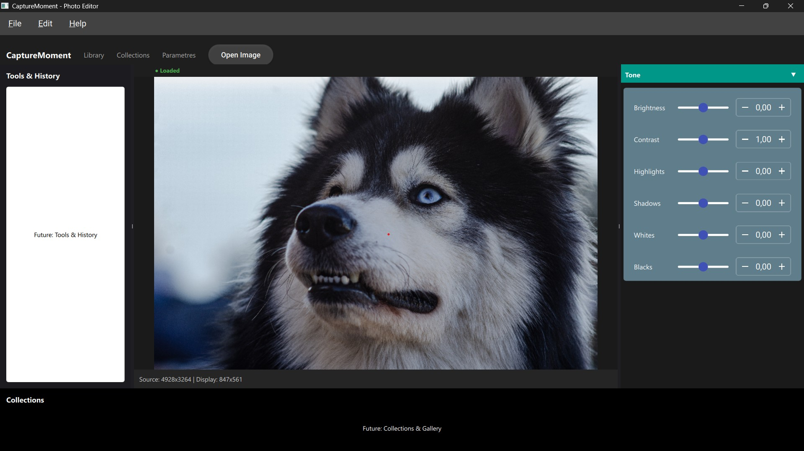

# Capture Moment

**An open-source, non-destructive photo editing application (GPLv3), cross-platform (desktop + mobile), featuring RAW processing, cataloging, and professional color science.**

---

## 🎯 Goal

Capture Moment aims to become a **performant and modular open-source alternative** software. Designed for **professional and advanced amateur photographers**, it offers a **modern**, **non-destructive**, and **color-accurate** photo workflow.

---

## ✨ Core Features

- **Advanced RAW Processing**: Supports major RAW formats via **OpenImageIO**.
- **Non-Destructive Pipeline**: Adjustments saved in **XMP sidecar files**.
- **Smart Cataloging**: Indexing via **SQLite**, advanced search, collections, keywords.
- **Professional Color Management**: Via **OpenColorIO** (planned integration).
- **Camera Profiles**: Automatic color correction based on camera model (**DCP support planned**).
- **Modern UI**: Smooth and reactive interface with **QML**.
- **Cross-Platform**: Compatible **Windows, macOS, Linux**. Ready for **mobile (iOS/Android)**.
- **Performance**: Fast calculations via **Halide**, intelligent caching via **OIIO**.
- **Integrated Benchmarking**: Tools to measure and ensure performance.

---

## 🛠️ Technologies

Capture Moment is built for performance and modularity, using best-in-class libraries for each technical challenge.

|     Component    |      Technology     |                              Role                             |
|:----------------:|:-------------------:|:-------------------------------------------------------------:|
| Language         | C++20 / C++23       | Core Logic, Speed, and Control.                               |
| Build System     | CMake 4.2+         | Cross-platform build configuration.                           |
| I/O & Cache      | OpenImageIO         | Read/Write all image formats, Tile-based caching.             |
| Processing       | Halide              | High-performance image processing pipeline optimization.      |
| UI               | Qt6 Quick/QML      | Modern, declarative, and hardware-accelerated user interface. |
| Color Management | OpenColorIO (already included in OpenImageIO)       | Industry-standard color space handling (Planned).             |
| Cataloging       | SQLite              | Fast, embeddable database for photo indexing.                 |
| Serialization    | Exiv2 (XMP) | Storing non-destructive Image    |
| setting    | JSON | Edits application settings.       |
---

## 📋 Documentation & Specs

For a detailed view of the architecture, technical choices, roadmap, and planned features:  

[➡️ Read the General Architecture Document](./docs/architecture/GENERAL_ARCHITECTURE.md).

---

## 🚀 Installation & Build

For detailed build instructions for each platform (Windows, macOS, Linux) and using various package managers (Vcpkg, Homebrew, apt/dnf):

[➡️ Read the full Build Guide](./docs/building/BUILDING_MAIN.md).

---

## 🤝 Contributing

Contributions are welcome! Whether you are a C++ developer, a designer, a tester, or a technical writer, your help is appreciated:

[➡️ Please read the Contribution Guide ](./docs/CONTRIBUTING.md) for details on setting up your environment and submitting changes.

---

## 📄 License

This project is distributed under the [GNU General Public License v3 (GPLv3)](./LICENSE).

**Redistribution Conditions:**
- Any redistribution (modified or not) must be under the same GPLv3 license.
- The name **CaptureMoment** and credits to the TEAM.
- It is forbidden to redistribute this software (or a modified version) under a name highly similar without explicit permission from the original author.
- Redistributions must include a link to the official repository and a clear mention of the source code origin.

See the [LICENSE](./LICENSE) file for more details.

---

> **Capture Moment** - *A photographic moment, captured freely.*